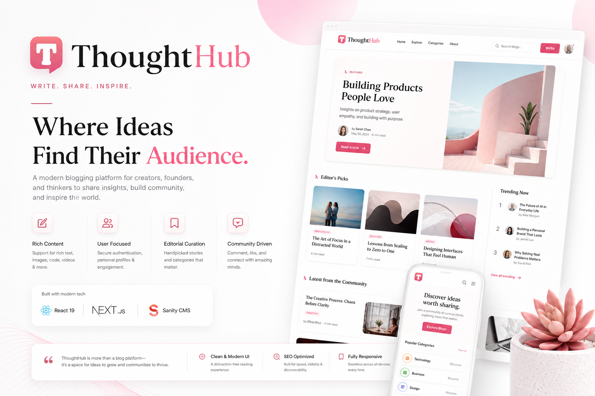

  

## ✍️ ThoughtHb

A modern, content-driven blogging platform built using **React 19**, **Next.js 15**, and **Sanity CMS**. This platform empowers users to share, discover, and engage with innovative blogs through a clean, user-friendly interface. It supports rich media content, user authentication, and editorial curation—designed for creators, founders, and blog enthusiasts.

---

## 🌐 Live Preview

🔗 [View Live](https://thought-hub-2852.vercel.app/)

---

## 🛠️ Tech Stack

- **React 19**: Modern, component-based library for building interactive UIs.
- **Next.js 15**: Full-stack React framework for server-side rendering, static site generation, and routing.
- **Tailwind CSS**: Utility-first CSS framework for fast, responsive design.
- **Sanity.io**: Headless CMS for flexible content management and real-time updates.
- **NextAuth.js**: Authentication solution for secure login via multiple providers.
- **Sentry**: Real-time error tracking and performance monitoring.

These technologies ensure a high-performance, scalable, and responsive web application with a focus on clean and maintainable code.

---

## 🔋 Features

👉 **Live Content API** – Dynamically loads the latest blog posts on the homepage via Sanity's Content API.  
👉 **GitHub Authentication** – Enables users to sign in securely using their GitHub accounts.  
👉 **Idea Submission** – Authenticated users can post blog ideas with titles, detailed descriptions, categories, and media (images/videos).  
👉 **Browse Posts** – Explore submitted blog entries with filtering by category.  
👉 **Post Details Page** – Full view of each blog, including embedded media and formatted content.  
👉 **User Profile Page** – View a list of blog posts authored by the logged-in user.  
👉 **Editor Picks** – Admins can highlight standout posts as "Editor Picks" through Sanity Studio.  
👉 **View Counter** – Tracks post popularity through views instead of likes or upvotes.  
👉 **Search Functionality** – Quickly search and locate startup ideas using keywords.  
👉 **Minimalist Design** – Clean, distraction-free UI focused on readability and user flow.  
👉 **Sentry Integration** – Implements Sentry for real-time error monitoring and bug resolution, ensuring a stable and smooth user experience.

And more—leveraging the latest **React**, **Next.js App Router**, and **Sanity features**, built with modular components, scalable structure, and reusability in mind.

---
